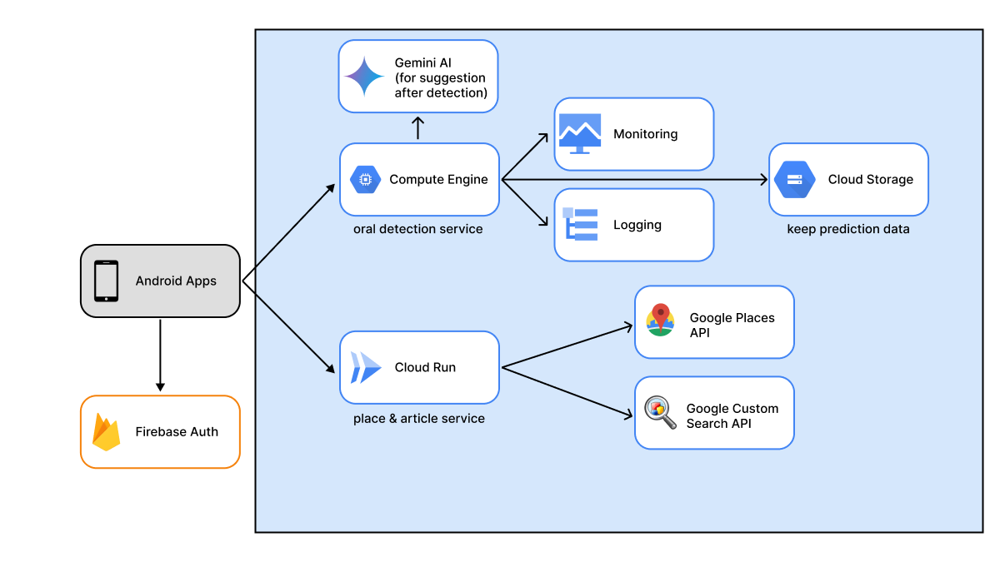

<h1 align="center">
  <br>
    
  <br>
    Dentiva
  <br>
    <small style="font-size: 16px"><em>Your Dental Detective for Healthy Mouths</em></small>
</h1>

## Table of Contents

- [Table of Contents](#table-of-contents)
- [Architecture](#architecture)
- [Development](#development)
- [Deployment](#deployment)
  - [Google Maps API](#google-maps-api)
  - [Google Custom Search API](#google-custom-search-api)
  - [Cloud Run](#cloud-run)
- [Project Structure](#project-structure)
- [API Documentation](#api-documentation)
- [Cloud Computing Team](#cloud-computing-team)

## Architecture

The architecture of this project can be seen in the image below.


## Development

- Clone this repository

```bash
git clone https://github.com/Dentiva-Bangkit/Cloud-Computing
```

- Create `.env` file with the following contents

```dotenv
GOOGLE_MAPS_API_KEY="<GOOGLE_MAPS_API_KEY>"
GOOGLE_SEARCH_API_KEY="<GOOGLE_CUSTOM_SEARCH_API_KEY>"
```

- Install node_modules

```bash
$ npm install
```

- Running the app

```bash
# development
$ npm run start

# watch mode
$ npm run start:dev
```

## Deployment

The unspecified elements can be customized either individually or by utilizing preset values. Moreover, it facilitates the enhancement of diverse features, including configurations related to Google Places API and Google Custom Search API.

## Google Maps Api

- `Open GCP Console`: Log in to the Google Cloud Platform Console.

- `Create or Select Project`: Create a new project or choose an existing one.

- `Enable Google Places API`: In the left panel, navigate to "APIs & Services" -> "Library", search for and enable "Google Places API".

- `Create API Key`: Go to "APIs & Services" -> "Credentials", click "Create Credentials", choose the API key type, and set restrictions if needed.

- `Get API Key`: After creating the API key, copy the key code to `.env` for <GOOGLE_MAPS_API_KEY>.

## Google Custom Search API

- `Open GCP Console`: Log in to the Google Cloud Platform Console.

- `Create or Select Project`: Create a new project or choose an existing one.

- `Enable Google Custom Search API`: In the left panel, navigate to "APIs & Services" -> "Library", search for and enable "Google Custom Search API".

- `Create API Key`: Go to "APIs & Services" -> "Credentials", click "Create Credentials", choose the API key type, and set restrictions if needed.

- `Get API Key`: After creating the API key, copy the key code to `.env` for <GOOGLE_CUSTOM_SEARCH_API_KEY>.

## Cloud Run

- **built docker images**

```bash
docker build -t api-model-dentiva .
```

- **before push to cloud run, you can make sure the application running locally**

```bash
docker run -p80:3000 nest-cloud-run
```

- **select your project id with google cloud cli**

```
gcloud config set project `PROJECT ID`
```

- **Use gcloud run deploy for deploy to cloud run**

Run the following command in your terminal at the root of your project:

```bash
gcloud run deploy
```

If prompted to enable the API, Reply y to enable.

1. When you are prompted for the source code location, press `Enter` to deploy the current folder.
2. When you are prompted for the service name, press `Enter` to accept the default name.
3. If you are prompted to enable the Artifact Registry API, respond by pressing `y`.
4. When you are prompted for region: select the region of your choice, for example, asia-southeast2.
   You will be prompted to allow unauthenticated invocations: respond `y` .
5. Then wait a few moments until the deployment is complete. On success, the command line displays the service URL.

Visit your deployed service by opening the service URL in a web browser.

## Project Structure

```bash
.
├── Dockerfile
├── README.md
├── dentiva.png
├── dentivaapi.md
├── nest-cli.json
├── package-lock.json
├── package.json
├── src
│ ├── app.controller.spec.ts
│ ├── app.controller.ts
│ ├── app.module.ts
│ ├── app.service.ts
│ ├── articles
│ │ ├── articles.controller.spec.ts
│ │ ├── articles.controller.ts
│ │ ├── articles.module.ts
│ │ ├── articles.service.spec.ts
│ │ ├── articles.service.ts
│ │ ├── dto
│ │ │ └── article.dto.ts
│ │ └── entities
│ │ └── article.entity.ts
│ ├── main.ts
│ └── places
│ ├── dto
│ │ └── place.dto.ts
│ ├── entities
│ │ └── place.entity.ts
│ ├── places.controller.spec.ts
│ ├── places.controller.ts
│ ├── places.module.ts
│ ├── places.service.spec.ts
│ └── places.service.ts
├── structure.txt
├── test
│ ├── app.e2e-spec.ts
│ └── jest-e2e.json
├── tsconfig.build.json
└── tsconfig.json
```

## API Documentation

The details of the API documentation can be accessed at [here](https://api-dentiva.web.app/apiDocs).

## Cloud Computing Team

| Name                       | Student ID   | Contact                                                                                                                                                                                                                                                                                                               |
| -------------------------- | ------------ | --------------------------------------------------------------------------------------------------------------------------------------------------------------------------------------------------------------------------------------------------------------------------------------------------------------------- |
| Muhammad Alfarel Yudistira | C204D4KY0668 | <a href="https://www.linkedin.com/in/muhammad-alfarel-yudistira/"></a> <a href="https://github.com/Farelis30/"></a> |
| Achmad Ryan Fachruddin     | C204D4KY0176 | <a href="https://www.linkedin.com/in/achmad-ryan-f-313baa30a"></a> <a href="https://github.com/ach-yan"></a>        |
